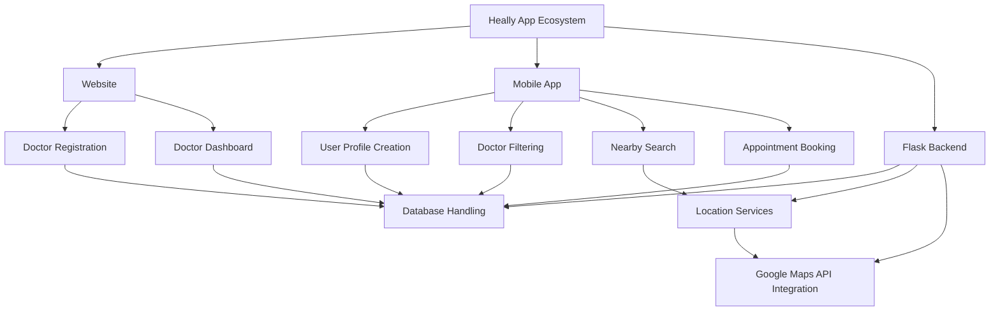

# Technical Spec Doc

Created by: yogendra tiwari
Created time: September 11, 2024 4:53 PM
Tags: Engineering

# Problem statement

Doctors are lifesavers and that is why they shouldn’t be too far from
those who need healthcare. With more and more people having the need to seek medical attention, doctors need to make their services accessible and available to their patients. In this time and age where everything and anything can be found on the internet, we need to take advantage of the digital tools/ channels to enable quick scheduling of appointments.

## Goals

The problem solution should satisfy some goal which are

- Find availability of all doctors basis their specialty
- Ability to find doctors near your location with doctors list sorted basis the shortest distance
- Book the appointment and receive confirmation notification in the app.
- There shall not be any conflicting consultation for the doctors/patients at the booked time slots.
- Reminder notification one hour before the appointment time with a link to driving
directions to doctor’s clinic

# Proposed solution

The Heally app will be developed using React Native, ensuring a smooth and consistent user experience across both iOS and Android platforms. This choice of technology allows for efficient development and maintenance of a single codebase for multiple platforms.

Key features of the Heally mobile app will include:

- User-friendly interface for patients to search and filter doctors by specialty and location
- Real-time availability tracking and appointment booking system
- Integrated map functionality to show doctor locations and provide directions
- Push notification system for appointment confirmations and reminders

**What are the high level architectural changes?**



**What is the high level data model?**

The high-level data model for the Heally app will be implemented using Firebase Firestore. The database will consist of two main collections: 'appointments' and 'users'. Here's a breakdown of each collection:

### Appointments Collection

```json
{
  "address": "",
  "date": "",
  "doctorID": "",
  "doctorName": "",
  "patientID": "",
  "patientName": "",
  "status": "",
  "time": ""
}
```

This structure allows for efficient tracking of appointments, including all necessary details about the doctor, patient, and scheduling information.

### Users Collection

```json
{
  "about": "",
  "address": "",
  "appointments": [],
  "email": "",
  "fees": "",
  "isDoctor": false,
  "name": "",
  "profileImage": "",
  "speciality": "",
  "userID": ""
}
```

This structure accommodates both patient and doctor profiles, with the 'isDoctor' field determining the user type. The 'appointments' array can store references to the user's appointments, enabling quick access to a user's appointment history.

This data model allows for efficient querying and real-time updates, which are crucial for features like appointment booking and availability tracking. The structure also supports scalability and future feature additions.

**What are the UI requirements?**

<aside>
💡

The UI requirements for the Heally app include the following screens and features:

</aside>

### 1. Login Screen

- User authentication form with email and password fields
- Option to reset password
- Sign up button for new users

### 2. Home Screen

- Quick access to search functionality
- Notifications center for appointment reminders
- Navigation menu to access other app sections

### 3. Search Screen

- Search bar for doctor's name or specialty
- Filters for location, availability, and ratings
- List view of doctors with basic information
- Map view option to see doctor locations (redirects to google maps)

### 4. Profile Screen

- Dashboard displaying upcoming appointments
- User's personal information and photo
- Medical history section
- Past appointments log
- Settings for notifications and app preferences

### Additional Features

- Appointment Booking: After selecting a doctor, users can choose available time slots and confirm booking
- Confirmation Message: Upon successful booking, a confirmation message is displayed within the app
- Reminder Notification: 1 hour before the appointment, a push notification is sent to the user with appointment details and directions to the clinic

The UI should be designed with a clean, intuitive layout, using a color scheme that aligns with Heally's branding. Emphasis should be placed on accessibility and ease of navigation between screens.

<aside>
💡

The UI requirements for the Heally Website include the following screens and features:

</aside>

### 1. Home Page

- Welcoming landing page with information about Heally's services
- Clear call-to-action buttons for "Create Account" and "Sign In"
- Section highlighting the benefits for doctors joining the platform

### 2. Sign Up Page

- Registration form for new doctors
- Fields for personal information, medical credentials, and specialties
- Option to upload necessary documents for verification

### 3. Sign In Page

- Login form with email and password fields
- "Forgot Password" link for password recovery

### 4. Doctor Dashboard

- Overview of upcoming appointments
- Calendar view for easy scheduling management
- Patient information for scheduled appointments
- Option to update availability and working hours

### 5. Profile Management Page

- Edit personal and professional information
- Update profile picture and clinic details
- Manage services offered and consultation fees

### 6. Appointment History

- List of past appointments with patient details
- Option to add notes or follow-ups for each appointment

The website should have a responsive design to ensure compatibility with various devices and screen sizes. The interface should be intuitive and easy to navigate, with a professional look that instills trust in potential patients.

**Are there any backwards-incompatible changes?**

None

**Does this project have any dependencies?**

## Web:

- React
- Firebase
- Tailwind
- React router-dom
- ShadCN
- Date-FNS
- lucide-react

## App:

- React Native async storage
- react native firebase
- react navigation / bottom tabs
- react navigation / native-stack
- expo-locations
- gesture handler
- loti react native
- expo image picker

## Server:

- Flask
- Flask-CORS
- googlemaps
- firebase_admin
- Python 3.12

# Implementation and rollout plan

1. Start Date: 09 / 09 / 2024
2. IMPLEMENT
3. End Date / Hackathon submission: 11 / 09 / 2024

**Does this project require a migration?**

No

**Is this project in an experiment or feature flagged?**

No